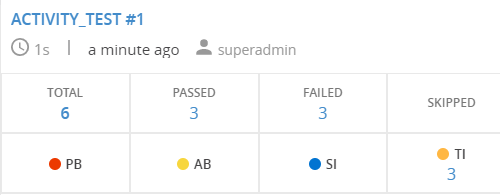
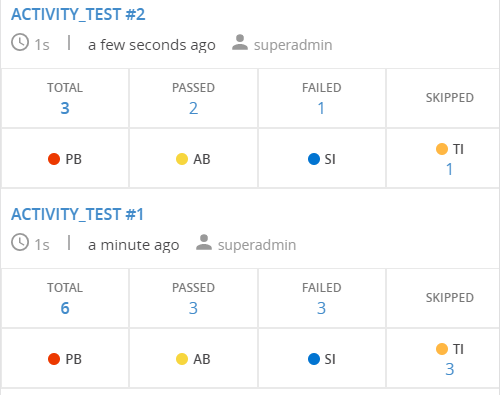
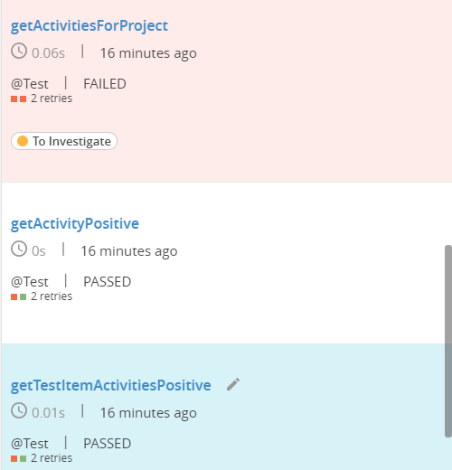

# Rerun developers guide

1. [What is rerun](#what-is-rerun)
1. [How to start rerun](#how-to-start-rerun)
    1. [Latest launch](#latest-launch)
    1. [Specified launch](#specified-launch)
1. [Test items behavior](#test-items-behavior)
1. [Example](#example)

## What is rerun

Let's imagine we have some set of tests:


After run we can see few failed items:



We are fixing issues and want to launch tests again. But running all the tests can take a lot of time. So it would be better to run only failed tests from previous launch.
Now we have the following:



So what do we have here? Two launches with the same test that was just be started again, but they are have difference in passed and failed items. And it is hard to find which test was fixed and which was not.

The main idea of reruns is to restart the same launch and trace changes between them not creating new launch every time.

Let's try to report the same launches using retries.


We have only one launch with last run data



On the step view we can see that items with names `getActivitiesForProject`, `getActivityPositive` and `getTestITemActivitiesPositive` have retries. Items `getActivityPositive` and `getTestITemActivitiesPositive` was fixed and `getActivitiesForProject` is still failing.

## How to start rerun

### Latest launch

To start launch rerun set `rp.rerun=true` in `reportportal.properties` file. In case properties file contains the value, client send request with object `"rerun": true`:
```json
{
    "name": "launch_name",
    "description": "some description",
    "mode": "DEFAULT",
    "rerun": true
}
```

System tries to find the latest launch on the project with same name as in request. If launch found system updates the following attributes if they are present in request:
- Mode
- Description
- Attributes
- UUID
- Status = `IN_PROGRESS` 

and returns response containing found launch id and number:
```json
{
  "id": "89f6d409-bee0-428e-baca-4848f86c06e7",
  "number": 4
}
```

If system cannot find launch with the same name system throws error with `404` code.

### Specified launch

To start launch rerun set `rp.rerun=true` and `rp.rerun.of=launch_uuid` in `reportportal.properties` file where `launch_uuid` uuid of launch that have to be reruned.

## Test Items behavior

### Container types (has children)

System tries to find item with the same name, set of parameters and under the same path. If such item found, system updates the following attributes:

- Description
- UUID
- Status = `IN_PROGRESS`
 
If not - new item will be created.

### Step types (without children)

System tries to find item with the same name, set of parameters and under the same path. If such item found, retry created. If not - new item will be created.

## Example

You can try to rerun launch [here](https://github.com/reportportal/examples-java)


